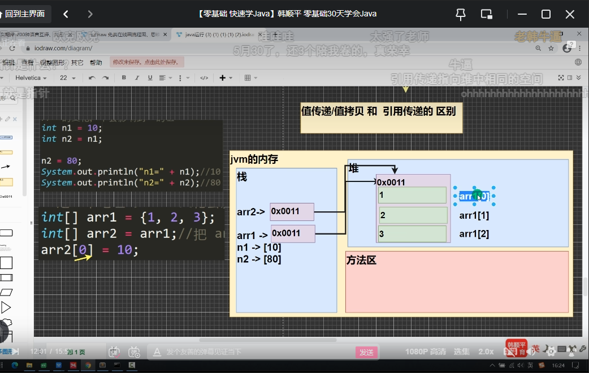
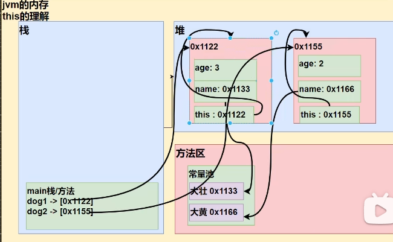
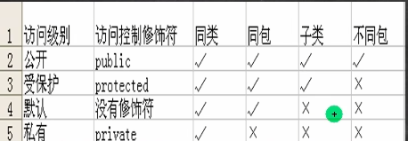
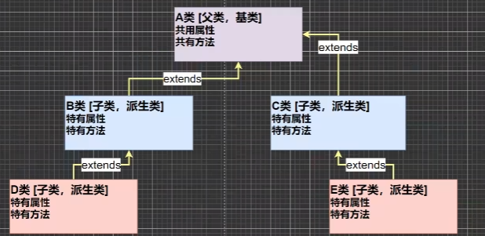
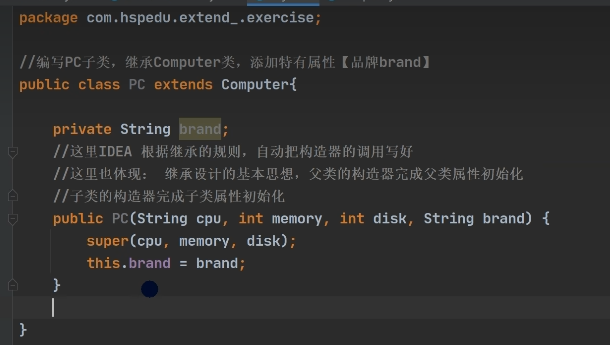
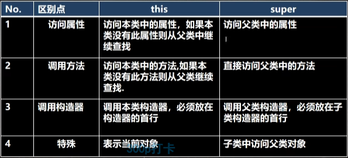
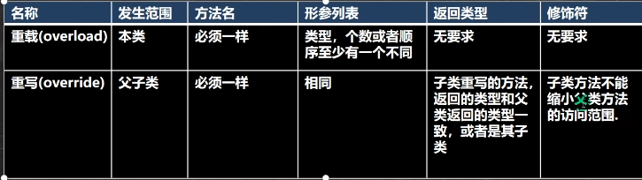
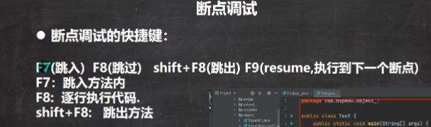

选中代码，按Tab整体向右移
选中代码，按shift+Tab整体向左移


javadoc -d 文件夹名 -xx -yy Comment02.java生成文档注释


序列、

- 右键创建列表
- 回车键
  - 先回车，后Tab
    - 同理

---


查看指定目录下所有子集目录：tree

清屏：cls

退出DOS:exit

创建目录：md

删除目录:rd

拷贝文件：:copy

删除文件：del

输入内容到文件：echo

剪切(移动)：move


浮点数：最后可加f/F表示单精度浮点数。

直接查询得到的小数或者直接赋值，可以判定相等，若计算得出小数则得到的是一个近似数。


# 包

## 接口

## 类

### 字段、构造器、成员方法

## 异常


==相对路径==：从当前目录开始定位，形成的一个路径。

==绝对路径==：从顶级目录开始定位，形成的一个路径。

==进制==

二进制：以0b或0B开头

八进制：以数字0开头。

十六进制：以0x或0X开头，数字中字母不区分大小写。


布尔类型：bolean

精度小的类型可自动类型转化

==(byte > short)char > int > loong > float > double==

char和byte、short不能互相转换

byte、short、char三者可以运算，在计算时先转化为int。

boolean类型不参与自动转换

表达式结果的类型自动提升为操作数中最大的类型。

在数据前加"（数据类型）"表示强制转换

强转符号只对最近的操作数有效，往往使用小括号提升优先级。

char类型可以保存int的常量值，但不能保存int的变量值，需要进行强转。

==byte和short类型进行运算时当作int类型处理。==

基本类型转String类型只要将基本类型值+“”即可

String类型转基本数据类型通过基本类型的包装调用parseXX方法即可。


多种类型进行计算

==原码、反码、补码==

1、正数原码、反码、补码一致。

2、负数的反码为它的原码符号位不变、其它位取反、补码为反码加一。

3、0的反码、补码都是0。

4、java没有无符号数。

5、计算机运算都是以补码方式运算。

6、看运算结果要看原码。


==位运算==：按位与&、按位或|、按位异或^、按位取反~。

三元运算符

条件表达式？表达式1：表达式2；（条件表达式为真运行表达式1，否则运行表达式2.）

==表达式1和表达式2要为可以赋给接受变量的类型（或可以自动转换）==


算数右移>>:低位溢出，符号位不变，高位用符号位补充。

算数左移<<:符号位不变，低位补0

逻辑右移>>>


==程序控制结构==

分支控制：

单分支

双分支

多分支

嵌套分支

switch(对应各种case,如果没有一个case匹配则执行default.)

switch(表达式)其中表达式数据类型应该和case后常量类型一致，或者可以自动转成可以相互比较的类型。

表达式中返回值必须是：byte、short、int、char、enum[枚举]、string.

case子句中值必须为常量或常量表达式，不能是变量。


# 循环

## for循环

for(循环变量初始化；循环条件；循环变量迭代){循环操作(单条或多条操作)；}swq213


break 语句出现在多层嵌套语句中时，可以通过标签指明要终止的是那一层语句块   

continue用于跳出本次循环，而不是跳出循环。

return用在方法时，表示跳出方法，如果使用在main，表示退出主函数。


# 数组

数组声明方法：

(1).int [] 数组名= new int[n]

(2)先声明：int [] 数组名；

  再赋值：数组值=new int[];


注意：

1. 数组是多个相同数据的组合，实现这些数据的统一管理。
2. 数组中数据可以是任意类型，但不能混用。
3. 数组创建后如果没有赋值有默认值。
4. ==数组下标从0开始。==
5. 数组下标必须在指定范围内使用，否则报下标越界异常。
6. 数组是引用类型，数组型数据是对象。


数组默认情况下是引用传递，赋的值为地址，赋值方式为引用赋值。




## 冒泡排序法：（p173）

基本思想，通过对待排序的序列从后向前，依次比较相邻元素的值，若发现逆序则交换，是值比较大的元素逐渐从前移向后部，就像水下的气泡一样逐渐向上冒。


# 类和对象

1. 栈：一般存放基本数据类型（局部变量）。
2. 堆：存放对象（Cat cat，数组等）
3. 方法区：常量池，（常量比如字符串），类加载信息


## java创建对象流程

1. 先加载类信息（属性和方法信息，只加载一次）
2. 在堆中分配空间，进行默认初始化
3. 把地址赋值给p，p就指向对象。
4. 进行指定初始化。


# 成员方法使用

1.一个方法可以有0个参数，也可以有多个参数，中间逗号隔开。

2.参数可以是任意类型，包括基本类型或引用类型。

3.调用带参数的方法时，一定对应参数列表传入相同类型或兼容类型的参数。

4.方法定义时的参数称为形参；方法调用时传入参数称为实际参数，简称实参，实参和形参的类型要一致或兼容、个数、顺序必须一致。

==方法体中不能再定义方法==


## 方法重载

允许一个类中，多个同名方法的存在，但要求形参列表不一致

重载的好处：减轻起名和记名的麻烦。


## 可变参数

java允许将同一个类中多个同名同功能但参数不同的方法，封装成一个方法就可以通过可变参数实现。

基本语法：

访问修饰符 返回类型 方法名（==数据类型...== 形参名）{

}

注意：

1. 可变参数实参可以是o0个或多个。
2. 可变参数的实参可以为数组
3. 可变参数的本质就是数组
4. 可变参数可以和普通参数以前放在形参列表，但必须保证可变参数在最后。


## 作用域

局部变量一般说的是成员方法中的变量。

全局变量，即是属性，作用域为整个类体

局部变量，就是除了属性外的其他变量，作用域为定义它的代码块中

全局变量可以不赋值直接使用，因为有默认值，局部变量必须赋值后才能使用，不会默认初始化，没有默认值。

属性和局部变量可以重名，使用遵循就近原则。

全局变量（属性)可以加修饰符，局部变量不可以加修饰符。


## 构造方法/构造器

==构造器==是初始化对象，对象之前已经存在，是类的一种特殊方法

- 一个类可以定义多个不同构造器，即是构造器重载
- 构造器名和类名要相同
- ==构造器没有返回值==
- 构造器完成对象的初始化，并不是创建对象
- 在创建对象时，系统自动调用该类的构造器方法
- 如果没有定义构造器，则系统会自动给类生成一个默认无参构造器（也叫默认构造器），可以通过反编译来观察默认无参构造器。
- 一旦定义了自己的构造器，默认构造器就被覆盖了，不能再使用默认无参构造器，除非重新显式定义一下。


## 对象创建流程

1. 加载类信息，只加载一次，加载到方法区
2. 在堆中分配空间（地址）
3. 完成对象初始化（先默认，再显式初始化，最后进行构造器的初始化）
4. 在对象在堆中的地址返回给p（对象名，或者说对象的引用）。


# this关键字

java虚拟机会给每一个对象分配this,代表当前对象 本身

简单的说就是哪个对象调用，this就代表哪个对象。



## this注意细节

1. ### ==用this访问构造器的语法：this（参数列表）只能在构造器中使用即只能在构造器中访问另外一个构造器，且必须放置在第一条语句。==

2. this关键字可以用来访问本类的属性、方法、构造器

3. this用于区分当前类的属性和局部变量

4. 访问成员方法的语句：this.方法名（参数列表）

5. this不能在类定义的外部使用，只能在类定义的方法中使用。


没有引用的对象称为匿名对象，只可以使用一次


# 包

包的本质实际上就是创建不同的文件夹/目录来保存类文件


## 包的命名

只能包含数字、字母、下划线、小圆点、但不可以是数字开头，不能是保留字或关键字。


引入包的目的就是为了使用该包下的类，使用impor语法


# Idea快捷键

删除当前行 ：ctrl+d

补全代码：alt+/

格式化代码：ctrl +alt+L

快速运行程序：alt+r

快速运行：shift+F10

添加构造器：alt+insert

查看类的继承关系：ctrl+H

定位类方法：ctrl+B

自动分配变量名：通过在后面加.var


模板：极大提高写代码效率


包导入建议用到什么导入什么，而不是import *形式

package的作用是声明当前类所在的包，需要放在类的最上面，一个类最多有一句package


## 访问修饰符

public：公开级别，对外公开

protected：受保护级别，对子类和同一个包中的类公开

默认级别：没有修饰符，对同一个包中的类公开

private：私有级别，只有类本身可以访问，不对外公开



- 修饰符可以修饰类中的属性，方法以及类
- 只有默认的和public才能修饰类，并且遵守上述访问权限的特点
- 成员方法的访问规则和属性一致


# 面向对象三大特征

封装，继承和多态


## 封装

把抽象的数据（属性）和对数据的操作（方法）封装在一起，数据被保护在内部，程序其他部分只能通过被授权的操作（方法），才能对数据进行操作。


好处：

- 隐藏实现细节
- 对数据进行验证，保证安全合理


### 实现步骤

1. 对属性进行私有化private
2. 提供一个公共的（public）set方法，用于对属性判断并赋值
3. 提供一个公共的（public）get方法，用于获取属性的值

==使用快捷键alt+ins进行生成选择getter和setter==

可以在set和get方法中加入对于数据的验证或者是对使用者进行身份验证。


## 继承

继承可以解决代码复用，当多个类存在相同的属性（变量）和方法时，可以从这些类中抽出父类，在父类中定义这些相同的属性和方法，所有子类不需要重新定义这些属性和方法，只需要通过==extents==来声明继承父类即可。



继承语法：

class 子类 extends 父类{

}

1. 子类自动拥有父类定义的属性和方法
2. 父类又叫超类，基类
3. 子类又叫派生类


继承好处：提高代码复用性

### 细节问题

1. 子类继承了所有的属性和方法，非私有的属性和方法可以在子类直接访问，但是私有属性和方法不能在子类中直接访问，要通过公共的方法来访问。
2. ==子类必须调用父类的构造器，完成父类的初始化。==
3. ==当创建子类对象时，不论使用子类哪个构造器，默认情况下总会去调用父类的无参构造器，如果父类没有提供无参构造器，则必须在子类的构造器中用super去指定使用父类的哪个构造器完成对父类的初始化工作，否则编译不通过。==
4. 如果要指定的调用父类的某个构造器，则显示的调用一下：super()。
5. super在使用时要放在构造器第一行。
6. super()和this()都只能放在构造器的第一行，因此这两个方法不能共存于一个结构。
7. java所有类都是object类的子类。
8. 父类构造器的调用不限于直接父类，可以一致追溯到Object类（顶级主类）。
9. 子类最多只能直接继承一个父类，即单继承机制
10. 不能滥用继承，子类和父类必须满足is-a的逻辑关系。


### 调用类中的数据遵守的规则

1. 首先看子类是否有该属性。
2. 如果子类有这个属性，并且可以访问，则返回信息。
3. 如果子类没有这个属性，就看父类有没有这个属性，(如果父类有该属性，并且可以访问，就返回信息...)
4. 如果父类没有就按照（3）的规则，继续找上级父类，直到Object..




### super关键字

代表父类的引用，用于访问父类的属性，方法，构造器

- 访问父类的属性，但不能访问父类的private属性：super.属性名
- 访问父类的方法，不能访问父类的private方法：super.方法名（参数列表）
- 访问父类的构造器：super（参数列表），只能放在构造器第一行。


### super和this的区别




### 方法重写/覆盖（override）

就是子类有一个方法和父类的某个方法==名称，返回类型，参数==都一致，那么我们说子类的这个方法覆盖了父类的方法。

#### 使用细节

1.  子类的方法的参数，方法名称，要和父类方法的参数，方法名称完全一样
2. 子类方法的返回类型和父类方法返回类型一样，或者是父类返回类型的子类，比如父类返回类型Object，子类方法返回类型是String
3. 子类方法不能缩小父类方法的访问权限 ，可以相同或增大。    


## 重载与重写




## 多态

1. 方法的多态：重写和重载就体现多态
2. 对象的多态（核心）：
   - 一个对象的编译类型和运行类型可以不一致
   - 编译类型在定义对象时，就确定了，不能改变
   - 运行类型是可以改变的
   - 编译类型看定义时等号的左边，运行类型看等号的右边


### 多态注意事项和细节

多态的前提时两个对象存在继承关系

#### 向上转型:

本质：父类引用指向子类对象

语法：父类类型 引用名=new 子类类型（）；

特点：编译类型看左边，运行类型看右边

​          可以调用父类中的所有成员（遵守访问权限）

​           不能调用子类中的特有成员，

​           最终运行结果看子类的具体实现。

#### 向下转型

1. 语法：子类类型 引用名=（子类类型） 父类引用
2. 只能强转父类的引用，不能强转父类的对象
3. 要求父类的引用必须指向当前目标类型的对象
4. 当向下转型后，就可以调用子类联系中所有的成员

#### 先有向上转型，再有向下转型

#### 属性没有重写只说，属性直接看编译类型 

instanceOf比较操作符，用于判断对象的==运行类型==是否为XX类型或者XX类型的子类型

### java动态绑定机制

1. 当调用对象==方法==时，该方法会和该对象的内存地址/运行类型绑定
2. 当调用对象==属性==时，没有动态绑定机制，哪里声明哪里使用 

## Object类详解

### equals方法

“==”和equals的对比

==是一个比较运算符：既可以判断基本类型（判断值是否相等），也可以判断引用类型（判断引用对象地址是否相等，即判断是否是一个对象）

equals只能判断引用类型,默认判断的是地址是否相等，子类往往重写该方法，用于判断内容是否相等。


### HashCode方法

返回该对象的哈希码值，支持此方法是为了提高哈希表的性能

小结

- 提高哈希结构容器的效率
- 两个引用如果指向同一个对象，则哈希值肯定是一样的
- 两个引用如果指向不同对象，则哈希值不一样
- 哈希值主要根据地址号来！==但不能完全讲哈希值等价于地址==


### toString方法

 默认返回：全类名+@+哈希值的十六进制，子类通常重写该方法，用于返回对象的属性信息

==直接输出一个对象是，toString方法会默认的调用==


### finalize方法

1. 当对象被回收是，系统自动调用该对象的finalize方法。子类可以重写该方法，做一些释放资源的操作。
2. 什么时候被回收：当某个对象没有任何引用时，则jvm就认为这个对象是一个垃圾对象，就会使用垃圾回收机制来销毁对象，在销毁该对象前会先调用finalize方法
3. 垃圾回收机制的调用，是由系统来决定，也可以通过System.gc（）主动出发垃圾回收机制


## 断点调试



## 类方法和类变量

static变量是对象共享的，不管static变量在哪里（jdk7、8以前存储在方法区中所实例出来的class类里，以后的版本中认为存储在堆里）共识：static变量是同一个类所有对象所共享的；static类变量在类加载时就生成了。


### 类变量使用细节


### 类方法的调用

类方法也叫静态方法。

形式：访问修饰符  static  数据返回类型  方法名(){}

（或static  访问修饰符  数据返回类型 方法名(){}）


调用方式：类名.类方法名 或者 对象名.类方法名（必须满足访问修饰符设定的访问权限）

### 类方法经典使用场景

当方法中不涉及任何和对象相关的成员，则可以将方法设计成静态方法，提高开发效率，例如工具类的方法utils

在实际开发过程中，通常将一些通用的方法，设计成静态方法，这样我们不需要创建对象就可以使用，例如打印一维数组，冒泡排序等。


### 类方法使用细节

1. 类方法和普通方法都是随着类的加载而加载，将结构信息存储在方法区：类方法中this参数，普通方法中隐含this参数

2. 类方法可以通过类名调用也可以通过对象名调用

3. 普通方法和对象有关，需要通过对象名调用，不能通过类名调用

4. 类方法中不允许使用和对象有关的关键字，比如this和super。普通方法（成员方法）可以。

5. 类方法（静态方法）中只能访问静态变量或者是静态方法。

6. 普通成员方法，既可以访问普通变量（方法），也可以访问静态变量（方法）

   总结：静态方法只能访问静态的成员，非静态方法可以访问静态成员和非静态成员。


## 深入理解main方法语法


注意：

1. 在main()方法中，我们可以直接调用main方法所在类的静态方法或静态属性
2. 但是不能直接访问该类中的非静态成员，必须创建该类的一个实例对象后，才能通过这个对象去访问该类中的非静态成员


## 代码块

代码块又称为初始化块，属于类中的成员[即是类的一部分]，类似于方法，讲逻辑语句封装在方法体中，通过{}包围起来。

但是和方法不同，没有方法名，没有返回，没有参数，只有方法体，而且不用通过对象或类显式调用，而是加载类时，或创建对象时隐式调用。


==代码块调用优先于构造器==

### 基本语法

[修饰符]{    代码

}；

注意：

1. 修饰符可选，如果写的话也只能写static
2. 代码块分为两类，使用static修饰的叫静态代码块，没有static修饰的叫普通代码块。
3. 逻辑语句可以为任何逻辑语句
4. “；”可以写上，也可以省略。


### 代码块使用细节

1. static 代码块也叫静态代码块，作用就是对类进行初始化，而且它随着类的加载而执行，而且只会执行一次。如果是普通代码块，每创建一个对象，就执行。

2. 类什么时候加载

   - 创建对象实例时
   - 创建子类对象实例，父类也会被加载（父类先加载，子类后加载）
   - 使用类的静态成员时（静态属性、静态方法）

3. 普通代码块，在创建实例时会被隐式调用，被创建一次就会调用一次。如果只是使用类的静态成员时，普通代码块不会执行。

4. 创建一个对象时，在一个类中调用顺序是（==重点、难点==）：

   1. 调用静态代码块和静态属性初始化（注意：静态代码块和静态属性初始化调用的优先级一样，如果有多个静态代码块和多个静态变量初始化，则按他们定义的顺序调用）
   2. 调用普通代码块和普通属性的初始化（注意：普通代码块和普通属性初始化调用的优先级一样，如果有多个普通代码块和多个普通属性初始化，则按定义顺序调用）
   3. 调用构造方法

   总结：1.静态2.普通3.构造器

5. 构造器的最前面其实隐含了super（）和调用普通代码块

6. (==非常重要==）创建一个子类对象时，他们的静态代码块，静态属性初始化，普通代码块，普通属性初始化，构造方法的调用顺序如下：

   - 父类的静态代码块和静态属性
   - 子类的静态代码块和静态属性
   - 父类的普通代码块和普通属性初始化
   - 父类的构造方法
   - 子类的普通属性和普通代码块的初始化
   - 子类的构造方法

7. 静态代码块只能调用静态成员，普通代码块可以调用任意成员。

==391==


## 四种内部类


### 局部内部类


### 匿名内部类！！！


### 成员内部类

说明：成员内部类定义在外部类的成员位置，并且没有static修饰。

1. 可以直接访问外部类的所有成员，包含私有的。
2. 可以添加任意修饰符，因为它的地位就是一个成员。
3. 作用域和外部类的其他成员相同，为整个类体，在外部类的成员方法中创建成员内部类对象，再调用方法。
4. 成员内部类直接访问外部类属性。
5. 外部类要先创建对象再访问内部类。
6. 外部其他类---访问--->成员内部类。（三种方式）
   - 创建外部类，调用成员内部类，相当于把它当成一个成员。
   - 在外部类中创建一个方法返回该成员内部类对象。
7. 如果外部类成员和内部类成员重名，则访问时遵循就近原则，如果要访问外部类成员，可以通过 外部类名.this.属性  来访问外部类成员。

### 静态内部类

说明：定义在外部类的成员位置，用static修饰

1. 可以直接访问外部类的所有静态成员，包括私有的，但不能直接访问非静态成员。
2. 可以使用任意修饰符，因为它的地位就是一个成员。
3. 作用域和其他成员相同，为整个类体。
4. 静态内部类可直接访问外部类的所有静态成员。
5. 外部类访问静态内部类，要先创建对象，然后调用方法。
6. 外部其他类调用方法类似上个类，同时多了一种通过类名加内部类名的方法调用，因为它是静态类。
7. 成员重名处理方法和其他类相同。


## 抽象类

抽象类除了不能实例化对象之外，类的其它功能依然存在，成员变量、成员方法和构造方法的访问方式和普通类一样。

由于抽象类不能实例化对象，所以抽象类必须被继承，才能被使用。也是因为这个原因，通常在设计阶段决定要不要设计抽象类。

父类包含了子类集合的常见的方法，但是由于父类本身是抽象的，所以不能使用这些方法。

在 Java 中抽象类表示的是一种继承关系，一个类只能继承一个抽象类，而一个类却可以实现多个接口。

### 抽象方法

如果你想设计这样一个类，该类包含一个特别的成员方法，该方法的具体实现由它的子类确定，那么你可以在父类中声明该方法为抽象方法。

Abstract 关键字同样可以用来声明抽象方法，抽象方法只包含一个方法名，而没有方法体。

抽象方法没有定义，方法名后面直接跟一个分号，而不是花括号


声明抽象方法会造成以下两个结果：

- 如果一个类包含抽象方法，那么该类必须是抽象类。
- 任何子类必须重写父类的抽象方法，或者声明自身为抽象类。

继承抽象方法的子类必须重写该方法。否则，该子类也必须声明为抽象类。最终，必须有子类实现该抽象方法，否则，从最初的父类到最终的子类都不能用来实例化对象。


### 总结

1. 抽象类不能被实例化(初学者很容易犯的错)，如果被实例化，就会报错，编译无法通过。只有抽象类的非抽象子类可以创建对象。

2. 抽象类中不一定包含抽象方法，但是有抽象方法的类必定是抽象类。

3. 抽象类中的抽象方法只是声明，不包含方法体，就是不给出方法的具体实现也就是方法的具体功能。

4. 构造方法，类方法（用 static 修饰的方法）不能声明为抽象方法。

5. 抽象类的子类必须给出抽象类中的抽象方法的具体实现，除非该子类也是抽象类。


## Java接口

接口（英文：Interface），在JAVA编程语言中是一个抽象类型，是抽象方法的集合，接口通常以interface来声明。一个类通过继承接口的方式，从而来继承接口的抽象方法。

接口并不是类，编写接口的方式和类很相似，但是它们属于不同的概念。类描述对象的属性和方法。接口则包含类要实现的方法。

除非实现接口的类是抽象类，否则该类要定义接口中的所有方法。

接口无法被实例化，但是可以被实现。一个实现接口的类，必须实现接口内所描述的所有方法，否则就必须声明为抽象类。另外，在 Java 中，接口类型可用来声明一个变量，他们可以成为一个空指针，或是被绑定在一个以此接口实现的对象。

### 接口与类对比：

相同：

- 一个接口可以有多个方法。
- 接口文件保存在 .java 结尾的文件中，文件名使用接口名。
- 接口的字节码文件保存在 .class 结尾的文件中。
- 接口相应的字节码文件必须在与包名称相匹配的目录结构中。


不同点：

- 接口不能用于实例化对象。
- 接口没有构造方法。
- 接口中所有的方法必须是抽象方法，Java 8 之后 接口中可以使用 default 关键字修饰的非抽象方法。
- 接口不能包含成员变量，除了 static 和 final 变量。
- 接口不是被类继承了，而是要被类实现。
- 接口支持多继承。


### 特性：

- 接口中每一个方法也是隐式抽象的,接口中的方法会被隐式的指定为 **public abstract**（只能是 public abstract，其他修饰符都会报错）。
- 接口中可以含有变量，但是接口中的变量会被隐式的指定为 **public static final** 变量（并且只能是 public，用 private 修饰会报编译错误）。
- 接口中的方法是不能在接口中实现的，只能由实现接口的类来实现接口中的方法。


重写接口中声明的方法时，需要注意以下规则：

- 类在实现接口的方法时，不能抛出强制性异常，只能在接口中，或者继承接口的抽象类中抛出该强制性异常。
- 类在重写方法时要保持一致的方法名，并且应该保持相同或者相兼容的返回值类型。
- 如果实现接口的类是抽象类，那么就没必要实现该接口的方法。


在实现接口的时候，也要注意一些规则：

- 一个类可以同时实现多个接口。
- 一个类只能继承一个类，但是能实现多个接口。
- 一个接口能继承另一个接口，这和类之间的继承比较相似。


### 接口的多继承

在Java中，类的多继承是不合法，但接口允许多继承。

在接口的多继承中extends关键字只需要使用一次，在其后跟着继承接口。


### 标记接口

没有任何方法的接口被称为标记接口。标记接口主要用于以下两种目的：

建立一个公共的父接口：

正如EventListener接口，这是由几十个其他接口扩展的Java API，你可以使用一个标记接口来建立一组接口的父接口。例如：当一个接口继承了EventListener接口，Java虚拟机(JVM)就知道该接口将要被用于一个事件的代理方案。

向一个类添加数据类型：

这种情况是标记接口最初的目的，实现标记接口的类不需要定义任何接口方法(因为标记接口根本就没有方法)，但是该类通过多态性变成一个接口类型。


## final修饰符

final 表示"最后的、最终的"含义，变量一旦赋值后，不能被重新赋值。被 final 修饰的实例变量必须显式指定初始值。

final 修饰符通常和 static 修饰符一起使用来创建类常量。

**final 方法**

父类中的 final 方法可以被子类继承，但是不能被子类重写。

声明 final 方法的主要目的是防止该方法的内容被修改。

如下所示，使用 final 修饰符声明方法。


## 元注解

### @Inherited注解


### @Retention注解


### @Target


### @Documented


## 异常处理

在程序执行中发生的不正常情况。（语法错误和逻辑错误不是异常）


执行过程中发生的异常事件分类两大类：

1. Error（错误）：Java虚拟机无法解决的严重问题。如：jvm系统内部错误、资源耗尽等严重情况。
2. Exception：其他编程错误或偶然的外在因素导致的一般性问题，可以使用针对性的代码进行处理。例如空指针访问，试图读取不存在的文件，网络连接中断等等

Exception分为两大类：运行时异常和编译时异常

### 常见的运行时异常：

1. NullPointerException空指针异常当应用程序试图在需要对象的地方使用null时，抛出该异常。
2. ArithmeticException数学运算异常:当出现异常的运算条件时，抛出此异常。
3. ArrayIndexOutOfBoundsException数组下标越界异常：用非法索引访问数组时抛出的异常。如果索引为负或等于数组大小，则该索引为非法索引。
4. ClassCastException类型转换异常：当试图将对象强制转换为不是实例的子类时，抛出异常。
5. NumberFormatExceprion数字格式不正确异常：当应用程序试图将字符串转换成一种数值类型，但该字符串不能转换为适当格式时，抛出该异常=>使用异常我们可以确保输入是满足条件数字。

编译异常：指在编译期间就必须处理的异常，否则代码不能通过编译：


 

### throws使用细节和注意事项


### 异常处理方式

处理方式1：

```
try-catch-finally
```


执行顺序总结：

1. 如果没有异常，则顺序执行try块中所有语句，不执行catch块中语句，如果最后有finally，最后还要执行finally块中语句。
2. 如果出现异常，则try块中异常发生后，try块剩下的语句不再执行。将执行catch块中的语句，如果有finally，最后还要执行finally块中语句。

处理方式2：

```
throws
```


### 自定义异常

步骤：

1. 定义类：自定义异常类名，继承Exception或RuntimeException
2. 如果继承Exception，属于编译异常
3. 如果继承RuntimeException，属于运行时异常（一般继承RuntimeException）


## 泛型

定义泛型方法的规则：

- 所有泛型方法声明都有一个类型参数声明部分（由尖括号分隔），该类型参数声明部分在方法返回类型之前（在下面例子中的 **<E>**）。
- 每一个类型参数声明部分包含一个或多个类型参数，参数间用逗号隔开。一个泛型参数，也被称为一个类型变量，是用于指定一个泛型类型名称的标识符。
- 类型参数能被用来声明返回值类型，并且能作为泛型方法得到的实际参数类型的占位符。
- 泛型方法体的声明和其他方法一样。注意类型参数只能代表引用型类型，不能是原始类型（像 **int、double、char** 等）。


### **java 中泛型标记符：**

- **E** - Element (在集合中使用，因为集合中存放的是元素)
- **T** - Type（Java 类）
- **K** - Key（键）
- **V** - Value（值）
- **N** - Number（数值类型）
- **？** - 表示不确定的 java 类型

